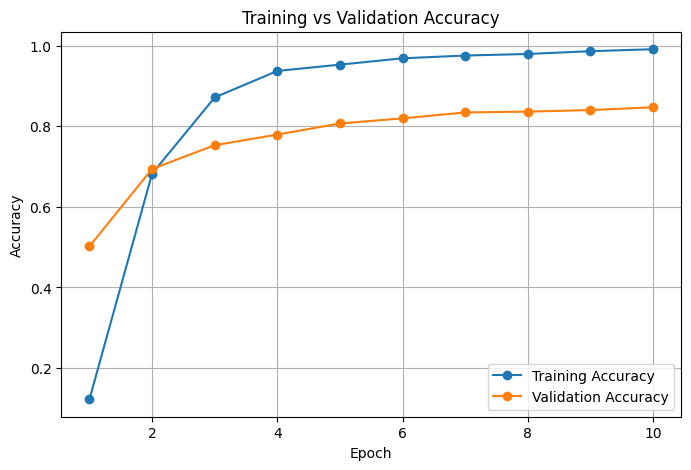
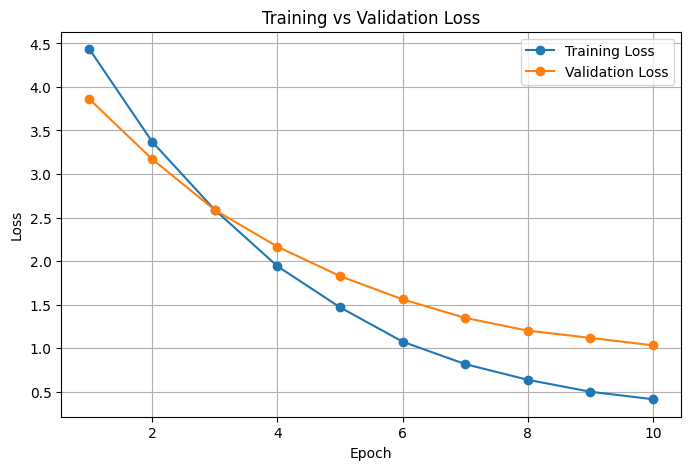
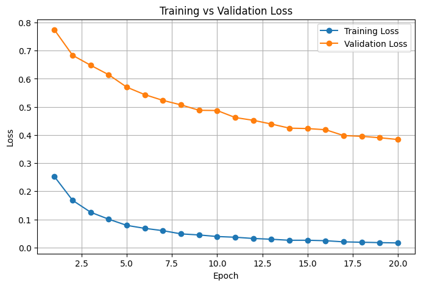
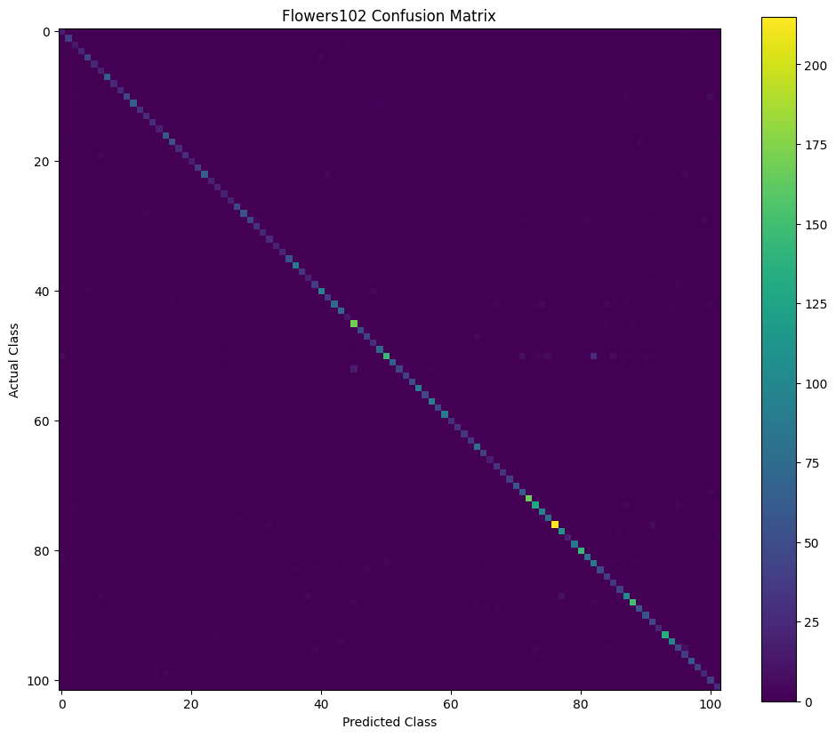

# 🌸 Flower Classification using EfficientNetV2-S (Transfer Learning)


A deep learning project that classifies **102 flower species** from the **Oxford Flowers102** dataset using **Transfer Learning** with **EfficientNetV2-S**. The project compares **Feature Extraction** and **Fine-Tuning** strategies to evaluate their impact on classification performance.

---

# 📌 Project Overview

Image classification generally requires large labeled datasets and significant computational resources. Transfer Learning allows pretrained CNN models to reuse learned visual features, reducing both training time and dataset requirements.

This project explores two transfer learning approaches:

- **Feature Extraction**
  - Freeze the pretrained backbone.
  - Train only the final classifier.

- **Fine-Tuning**
  - Unfreeze the pretrained backbone.
  - Update both backbone and classifier using a smaller learning rate.

The objective is to analyze how fine-tuning improves performance over feature extraction on the Oxford Flowers102 dataset.

---

# 📂 Dataset

**Dataset:** Oxford Flowers102

- **102 Flower Categories**
- **Training Images:** 1,020
- **Validation Images:** 1,020
- **Testing Images:** 6,149

Dataset:

https://www.robots.ox.ac.uk/~vgg/data/flowers/102/

---

# 🧠 Model Architecture

**Backbone**

- EfficientNetV2-S
- Pretrained on ImageNet-1K

**Framework**

- PyTorch
- Torchvision

---

# ⚙️ Training Pipeline

## Image Preprocessing

- Resize: **384 × 384**
- Center Crop
- Normalization using ImageNet statistics

## Feature Extraction

- Frozen EfficientNetV2-S backbone
- Train only classifier
- Optimizer: Adam
- Loss Function: CrossEntropyLoss

## Fine-Tuning

- Unfreeze complete backbone
- Very small learning rate
- Optimizer: Adam
- CrossEntropyLoss

---

# 📊 Experimental Results

| Experiment | Strategy | Test Accuracy |
|------------|----------|--------------:|
| Experiment 1 | Feature Extraction | **82.97%** |
| Experiment 2 | Fine-Tuning | **89.98%** |

---

# 📈 Fine-Tuned Model Performance

| Metric | Score |
|---------|------:|
| Test Accuracy | **89.98%** |
| Macro Precision | **0.89** |
| Macro Recall | **0.92** |
| Macro F1-score | **0.90** |
| Weighted Precision | **0.91** |
| Weighted Recall | **0.90** |
| Weighted F1-score | **0.90** |

---

# 📉 Training Curves

## Feature Extraction

### Accuracy



### Loss



---

## Fine-Tuning

### Accuracy


### Loss



---

# 📊 Confusion Matrix



---

# 🔍 Classification Report

The fine-tuned model achieved:

- **Overall Accuracy:** **89.98%**
- **Macro F1-score:** **0.90**
- **Weighted F1-score:** **0.90**

The model performed strongly across most flower categories while maintaining good generalization on unseen test data.

---

# 🌼 Common Misclassifications

Some visually similar flower species remained challenging.

| Actual Class | Predicted Class | Count |
|--------------|----------------|------:|
| Petunia | Hibiscus | 27 |
| Primula | Wallflower | 16 |
| Cyclamen | Lotus | 10 |
| Petunia | Azalea | 9 |
| Camellia | Mallow | 8 |
| Petunia | Tree Mallow | 7 |
| Passion Flower | Bee Balm | 6 |
| Snapdragon | Trumpet Creeper | 6 |
| Petunia | Pink Primrose | 6 |
| Petunia | Morning Glory | 6 |

These errors mainly occur because several flower species share similar colors, petal structures, and shapes.

---

# 📁 Repository Structure

```
Oxford-Flowers102-EfficientNetV2/
│
├── Transfer_Learning_Project.ipynb
├── README.md
├── requirements.txt
├── .gitignore
│
└── images/
    ├── feature_extraction_accuracy.png
    ├── feature_extraction_loss.png
    ├── fine_tuning_accuracy.png
    ├── fine_tuning_loss.png
    └── confusion_matrix.png
```

---

# 🛠️ Technologies Used

- Python
- PyTorch
- Torchvision
- NumPy
- Matplotlib
- Scikit-learn
- Google Colab

---

# 🚀 How to Run

Clone the repository

```bash
git clone https://github.com/chdevaanshita78/Oxford-Flowers102-EfficientNetV2.git
```

Open the project

```bash
cd Oxford-Flowers102-EfficientNetV2
```

Install dependencies

```bash
pip install -r requirements.txt
```

Run the notebook

```
Transfer_Learning_Project.ipynb
```

---

# 📌 Future Improvements

- Vision Transformer (ViT)
- EfficientNetV2-M / EfficientNetV2-L
- Data Augmentation (MixUp, CutMix)
- Cosine Learning Rate Scheduler
- Test-Time Augmentation
- Model Explainability using Grad-CAM

---

# 📚 References

- Oxford Flowers102 Dataset
- PyTorch Documentation
- Torchvision Models
- EfficientNetV2 Research Paper

---

# 👩‍💻 Author

**Anshita Sachdeva**

Computer Science Engineering (AI & ML)

Chitkara University

GitHub: https://github.com/chdevaanshita78

---

## ⭐ If you found this project useful, consider giving it a star!
